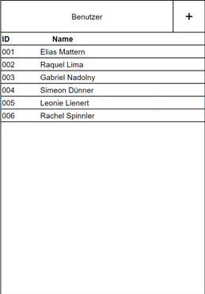
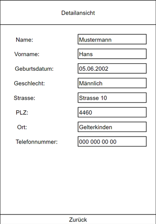
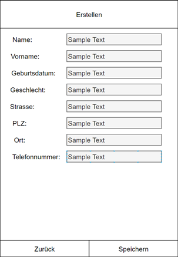

# Benutzer Verwaltung
## Java Projekt für modul 120.

# About
Dies ist ein Benutzer verwaltungs Programm. Man kann Nutzer editieren und hinzufügen. Sehr simpel :exploding_head: Das ganze ist in Java programmiert. :tada:			

# To-Do

- [x] MainGUI
- [x] CreateGUI
- [x] ViewGUI
- [x] User Datas
- [x] JList mit User Daten in der MainGUI
- [x] Funktion um User zu erstellen
- [x] User in der Detailview anzeigen

# Views
Main gui

Detail gui

Create gui

# Grade
pending... :octocat:	
